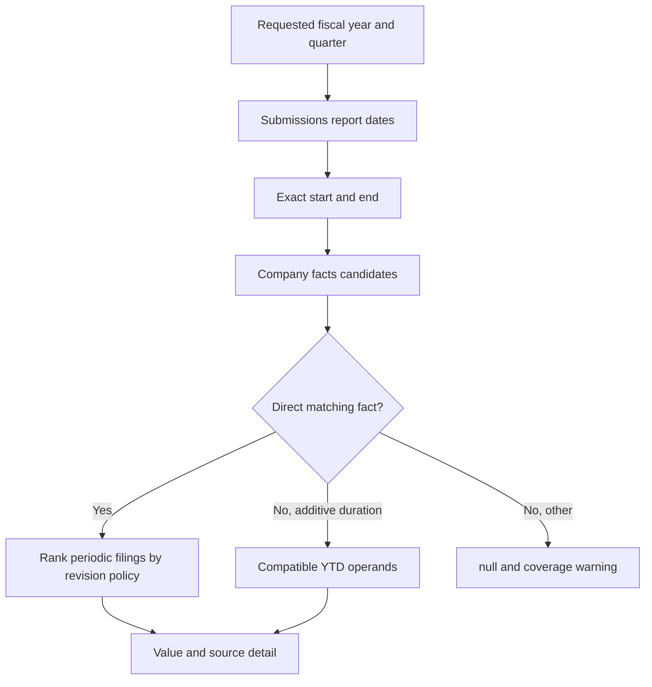

# Fiscal periods, selection, and lineage

The Apple FY2025 Q2 period runs 2024-12-29 through 2025-03-29. The [SEC company facts response](https://data.sec.gov/api/xbrl/companyfacts/CIK0000320193.json) reports revenue for that exact three-month duration and for six months beginning 2024-09-29. The direct quarter wins. A direct fact from any supported mapping alias wins before a derived value is attempted. If it were absent, the approved additive revenue concept could use six-month revenue minus first-quarter revenue. The result records both operands. Balance sheet assets at 2025-03-29 are an instant fact and are never subtracted. `CY2025Q1I` on the SEC frame is a calendar label, not Apple's fiscal quarter.

`latest` ranks exact-period facts across approved aliases by filing recency; `asFiled` prefers the target filing accession, and alias order breaks remaining ties. `asOf` excludes facts and filing metadata after the cutoff; it is not a historical API snapshot. Every chosen detail includes taxonomy, tag, unit, start/end, accession, form, filing date, and a full-submission archive URL. Set `trace: true` to see considered candidates and their rejection reasons, including when selection refuses conflicting values. Statements expose `coverage.missingCodes` and field-specific reasons. If fields come from several filings, a warning says so.

Selection requires the same tag and unit, matching fiscal start, and the same filing `fy` cohort (or accession) for both derived operands. The prior operand cannot be filed after the later one. Conflicting equal-source values or incompatible revisions leave the field unavailable rather than producing a plausible subtraction. This is a conservative client rule, not a filing-level audit. The result's `currency` is the requested three-letter unit, default `USD`; specify `EUR` for euro filings. No conversion occurs. Non-additive EPS is direct-only. Other unmapped standard concepts remain discoverable via `unmappedConcepts` and `xbrl.companyFacts`.

BayFirst's 2025 net income is -22,937,000 USD in the original 10-K and -24,565,000 USD in its later 10-K/A. `latest` selects the latter; `asFiled` selects the original. See the [restatement research](../research/financial-semantics.md).
