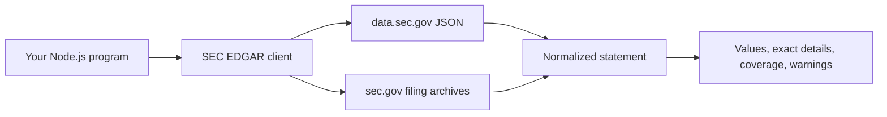

# SEC EDGAR Client

An unofficial, read-only Node.js library for public SEC data. It runs locally, makes requests directly to SEC hosts, and needs no API key. It never submits filings. SEC data can be delayed, corrected, removed, or incomplete.

Start with the [five-minute quick start](guide/quick-start.md), then inspect the [API reference](api/reference.md), [selection guide](guide/lineage.md), [source coverage](research/endpoint-inventory.md), and [known limitations](guide/limitations.md).
